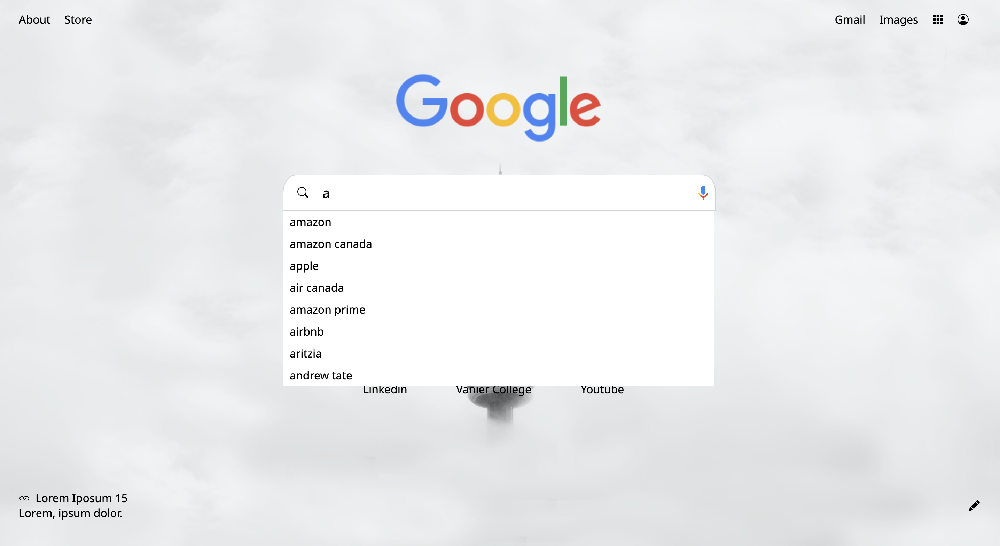
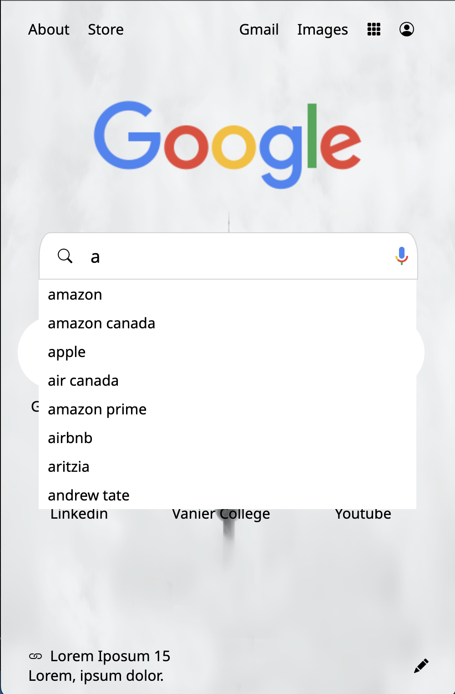

# Google-Clone :computer:
 A google chrome search engine UI clone.

 ## Description :book:
 - Create the google search engine UI and implement a live search using Ajax.
 - Responsive design

## Technology used
- HTML & CSS
- JavaScript
- jQUery
- Ajax 

# Desktop view

# Mobile view

## Credits
- Thanks to [Kaolin Stacey](https://github.com/Kaolinnie) for sharing me the ajax live search implementation.

